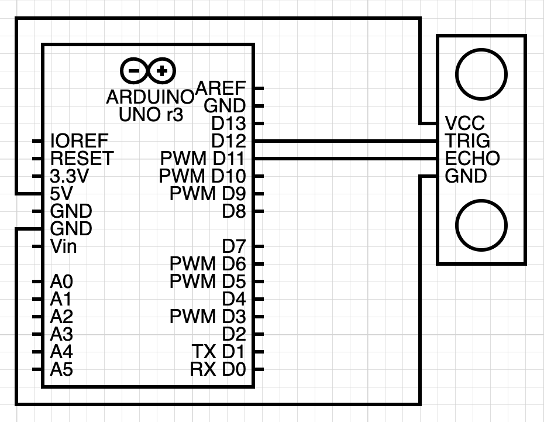

<h1 align="center">EZDist</h1>
An Arduino library to make usage of the HC-SR04 as easy as blinking an LED.
<br><br>
The distance sensor needs several lines of code to perform the simple task of returning the distance of the closest object, but now you can do this in one line! In addition, you can get the distance in centimters or inches.<br>

### Installation
1. Download as a zip file from [GitHub](https://github.com/gadhagod/EZDist).

2. Open Arduino IDE. On the top bar, select Sketch > Include > Library > Add .ZIP Library. Select the downloaded folder.

### Usage
1. Include library.
```
#include <EZDist.h>
```
2. Create instance of class `EZDist` with pin numbers.
```
EZDist EZDist(trigPin, echoPin);
```

3. Begin the serial monitor.
```
void setup() {
    Serial.begin(9600);
}
```

4. Print data.
```    
void loop() {
    Serial.println("Inches: " + 
    String(EZDist.inch()) + ", Centimeters: " + 
    String(EZDist.cm()));
}
```

### Examples
1. Under File > Examples > EZDist, select an example.
2. Make the following circuit: <br>

3. Run the example.

### Files
- Source: [EZDist.cpp](EZDist.cpp)
- Header: [EZDist.h](EZDist.j)
- Examples:
  - [Print raw distance](examples/PrintDistanceRaw/PrintDistanceRaw.ino)
  - [Print distance in cm](examples/PrintDistanceCentimeters/PrintDistanceCentimeters.ino)
  - [Print distance inches](examples/PrintDistanceInches/PrintDistanceInches.ino)